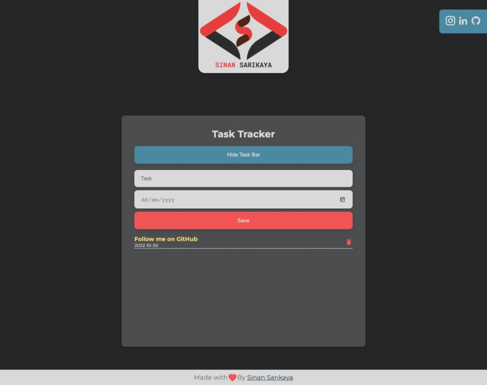

# React Task Tracker


Responsive task tracker made using React

<hr />

## What I Used

- Axios
- React-icons
- Sass
- Gh-pages (to publish on GitHub)

### Installation Options

```
$ git clone https://github.com/sinansarikaya/react-task-tracker.git
```

```
$ npm install
```

```
$ npm start
```

### Or

```
$ git clone https://github.com/sinansarikaya/react-task-tracker.git
```

```
$ yarn
```

```
$ yarn start
```

<hr />

### Demo

#### [View Demo](https://sinansarikaya.github.io/react-task-tracker/)



<hr />

### Try yourself

You can try to make it yourself by looking at the design in Figma.

#### [View the design in Figma](https://www.figma.com/file/2KIprXTiEeyKxUPnbtmXVi/Task-Tracker?node-id=0%3A1)
